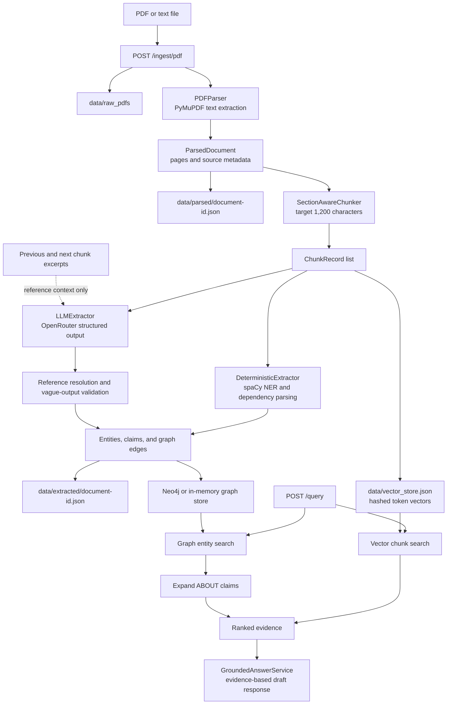
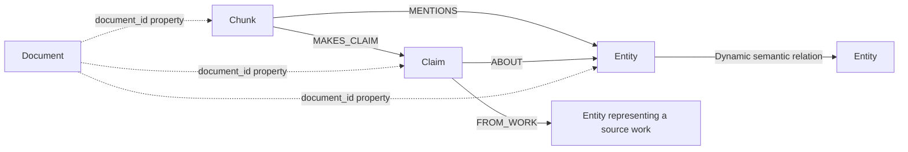

# Knowledge Graph Hybrid RAG

This repository is a working prototype for turning text-based PDFs into a searchable knowledge graph and combining graph retrieval with lightweight vector retrieval. It exposes ingestion and query operations through FastAPI, stores graph records in Neo4j or memory, and stores chunk vectors in a local JSON file.

The implementation currently has two extraction paths:

- A deterministic spaCy path for named entities, sentence-level claims, and dependency-based relations.
- An optional OpenRouter LLM path for structured entities, standalone claims, semantic relations, reference resolution, and source-work separation.

This is still an MVP. The graph is persistent and inspectable, but global entity canonicalisation, OCR, production embeddings, robust LLM retry handling, and generated answer synthesis are not complete.

## Current Process



The graph records currently form this shape:



`Document` ownership is currently represented through `document_id` properties rather than explicit Neo4j relationships.

## Repository Map

| Path | Responsibility |
| --- | --- |
| [`app`](app/README.md) | Application package, configuration, and FastAPI composition. |
| [`app/api`](app/api/README.md) | HTTP routes for health, ingestion, and querying. |
| [`app/ingest`](app/ingest/README.md) | Parsing, chunking, and end-to-end ingestion orchestration. |
| [`app/extract`](app/extract/README.md) | Deterministic and LLM-assisted graph extraction. |
| [`app/graph`](app/graph/README.md) | Graph-store interface, Neo4j adapter, and in-memory adapter. |
| [`app/retrieve`](app/retrieve/README.md) | File-backed vector search and graph-aware retrieval. |
| [`app/answer`](app/answer/README.md) | Evidence-to-response assembly. |
| [`app/models`](app/models/README.md) | Shared Pydantic records and API schemas. |
| [`app/eval`](app/eval/README.md) | Early evaluation helpers. |
| [`data`](data/README.md) | Local source files, generated JSON, vectors, test runs, and LLM usage logs. |
| [`tests`](tests/README.md) | Smoke and extraction-behaviour tests. |

## Requirements

- Python 3.11 or newer.
- Docker Desktop for the included Neo4j Compose service, or a separately managed Neo4j instance.
- The spaCy `en_core_web_sm` model.
- An OpenRouter API key only when LLM extraction is enabled.

## Setup

Create and activate a virtual environment:

```powershell
py -3.11 -m venv .venv
.\.venv\Scripts\Activate.ps1
python -m pip install --upgrade pip
python -m pip install -e ".[dev]"
python -m spacy download en_core_web_sm
```

Create the local configuration file:

```powershell
Copy-Item .env.example .env
```

Set `OPENROUTER_API_KEY` in `.env` if LLM extraction is required. To use only the deterministic extractor, set:

```dotenv
ENABLE_LLM_EXTRACTION=false
```

## Start Neo4j

The included Compose file starts Neo4j 5.26 with a persistent Docker volume:

```powershell
docker compose up -d
```

Open Neo4j Browser at [http://localhost:7474](http://localhost:7474) and connect with the credentials from `.env.example`:

```text
Username: neo4j
Password: knowledgegraph
Bolt URI: bolt://localhost:7687
```

If Neo4j Desktop is already running a DBMS on port `7687`, do not start the Compose service on the same port. Point `NEO4J_URI`, `NEO4J_USER`, and `NEO4J_PASSWORD` at the existing DBMS instead.

For an ephemeral graph during development, use:

```dotenv
GRAPH_BACKEND=in_memory
```

## Run the API

```powershell
python -m uvicorn app.main:app --reload
```

The API is available at `http://127.0.0.1:8000`, with generated OpenAPI documentation at [http://127.0.0.1:8000/docs](http://127.0.0.1:8000/docs).

## API Endpoints

| Method | Path | Purpose |
| --- | --- | --- |
| `GET` | `/health` | Returns a basic process health response. It does not currently probe Neo4j or OpenRouter. |
| `POST` | `/ingest/pdf` | Saves and ingests an uploaded PDF or text file. |
| `POST` | `/query` | Runs vector retrieval, entity lookup, claim expansion, and response assembly. |

Ingest a PDF:

```powershell
curl.exe -X POST http://127.0.0.1:8000/ingest/pdf `
  -F "file=@C:\path\to\paper.pdf"
```

Run a query:

```powershell
$body = @{
    question = "What are the limitations of generative agents?"
    top_k = 5
} | ConvertTo-Json

Invoke-RestMethod `
    -Method Post `
    -Uri http://127.0.0.1:8000/query `
    -ContentType "application/json" `
    -Body $body
```

## Extraction Behaviour

### Deterministic extraction

The deterministic extractor always runs. It uses `en_core_web_sm` to:

- Create entities from selected spaCy NER labels.
- Create claims from sufficiently long sentences containing assertion verbs.
- Link claims to entities in the same sentence with `ABOUT`.
- Create entity-to-entity relations from selected dependency-path verbs, falling back to `CO_OCCURS_WITH`.

These records have `extractor="spacy"` and fixed confidence values defined in the extractor.

### LLM extraction

The LLM extractor runs only when `ENABLE_LLM_EXTRACTION=true` and an API key is available. It:

- Sends the current chunk through OpenAI-compatible chat completions on OpenRouter.
- Requests a strict JSON schema and validates it with Pydantic.
- Supplies bounded excerpts from adjacent chunks for reference resolution only.
- Stores a reusable `canonical_name` and the original local wording in `mention_text`.
- Separates direct claim subjects, mentioned entities, and source works.
- Uses `ABOUT` for direct subjects and `FROM_WORK` for document context.
- Rejects unresolved entity names, non-standalone claims, invalid references, and malformed relations.
- Logs token usage, actual provider cost when returned, model, response ID, and validation counts per chunk.

LLM output is not globally canonicalised. Identical names extracted from different chunks currently become separate entity nodes because each record receives a new ID.

## Storage

| Data | Location | Notes |
| --- | --- | --- |
| Uploaded files | `data/raw_pdfs` | PDFs are ignored by Git. Despite the folder name, the parser also accepts `.txt`. |
| Parsed pages | `data/parsed/<document-id>.json` | Document metadata and page text. |
| Extracted records | `data/extracted/<document-id>.json` | Combined deterministic and LLM chunks, entities, claims, and edges. |
| Chunk vectors | `data/vector_store.json` | File-backed 256-dimensional hashed token vectors. This is not an external vector database. |
| LLM usage | `data/llm_usage.jsonl` | One provider usage and cost row per successful LLM chunk call. |
| Manual LLM runs | `data/llm_test_runs` | Experimental outputs; these are not imported into Neo4j automatically. |
| Graph data | Neo4j data directory or Docker `neo4j_data` volume | Not stored in this repository when Neo4j is used. |

All JSON and JSONL output is ignored by Git. The data remains local unless deliberately exported elsewhere.

## Useful Cypher Queries

Count records by node label:

```cypher
MATCH (n)
RETURN labels(n) AS labels, count(*) AS total
ORDER BY total DESC;
```

Inspect recent entities and their source wording:

```cypher
MATCH (e:Entity)
RETURN e.canonical_name, e.mention_text, e.label, e.extractor,
       e.document_id, e.page, e.confidence
ORDER BY e.page, e.canonical_name
LIMIT 100;
```

Visualise claims and their direct subjects:

```cypher
MATCH p=(c:Claim)-[:ABOUT]->(e:Entity)
RETURN p
LIMIT 75;
```

Compare source-work context with direct subject links:

```cypher
MATCH (c:Claim)-[r:ABOUT|FROM_WORK]->(e:Entity)
RETURN type(r) AS relationship, e.canonical_name, c.text,
       c.page, c.extractor
ORDER BY c.page
LIMIT 100;
```

Find duplicate canonical names that still need global canonicalisation:

```cypher
MATCH (e:Entity)
WITH toLower(e.canonical_name) AS name, collect(e) AS entities
WHERE size(entities) > 1
RETURN name, size(entities) AS duplicates,
       [e IN entities | e.id] AS entity_ids
ORDER BY duplicates DESC;
```

## Configuration

| Variable | Purpose |
| --- | --- |
| `RAW_DATA_DIR` | Uploaded source-file directory. |
| `PARSED_DATA_DIR` | Parsed-document JSON directory. |
| `EXTRACTED_DATA_DIR` | Extracted graph-record JSON directory. |
| `VECTOR_STORE_PATH` | File-backed vector-store path. |
| `GRAPH_BACKEND` | `neo4j` or `in_memory`. |
| `NEO4J_URI` | Neo4j Bolt connection URI. |
| `NEO4J_USER` | Neo4j username. |
| `NEO4J_PASSWORD` | Neo4j password. |
| `ENABLE_LLM_EXTRACTION` | Enables LLM extraction when an API key is also present. |
| `OPENROUTER_API_KEY` | OpenRouter credential. `LLM_API_KEY` and `OPENAI_API_KEY` are also accepted. |
| `LLM_BASE_URL` | OpenAI-compatible API base URL. |
| `LLM_MODEL` | Provider model identifier. |
| `LLM_EXTRACTION_MAX_CHUNKS` | Maximum chunks sent to the LLM for one ingestion. |
| `LLM_ADJACENT_CONTEXT_CHARS` | Characters taken from each adjacent chunk for reference resolution. |
| `LLM_USAGE_LOG_PATH` | Per-call JSONL usage log. |
| `LLM_INPUT_COST_PER_MILLION` | Optional local input-cost estimate. |
| `LLM_OUTPUT_COST_PER_MILLION` | Optional local output-cost estimate. |
| `LLM_COST_CURRENCY` | Currency label for local estimates. Actual OpenRouter cost is copied from its response. |
| `OPENROUTER_HTTP_REFERER` | Optional application URL sent to OpenRouter as `HTTP-Referer`. |
| `OPENROUTER_TITLE` | Optional application title sent to OpenRouter. |

## Tests

```powershell
python -m pytest -q
```

The current suite covers basic retrieval, disabled LLM behaviour, translation from structured extraction into graph records, OpenRouter request construction and cost logging, and vague-reference validation.

## Current Limitations

- PDF parsing uses the embedded text layer only. Scanned or image-only PDFs require OCR or a vision pipeline before this parser can extract useful text.
- Chunking is paragraph-oriented but long PDF text blocks can still produce chunks larger than the nominal target.
- Entity IDs are generated per extraction. There is no graph-wide alias or canonical entity layer yet.
- The LLM ingestion loop does not yet provide production-grade retry, backoff, or resumable checkpoint handling.
- The local vector implementation uses Python's built-in `hash()`. Hash randomisation means persisted vectors are not guaranteed to remain compatible across Python process restarts.
- Vector search is a hashed bag-of-words baseline, not a semantic embedding model or dedicated vector database.
- Entity graph search is substring-based and does not currently search aliases or embeddings.
- `GroundedAnswerService` assembles an evidence-based draft string; it does not yet call an answer-generation model.
- Experimental JSON files in `data/llm_test_runs` are not imported into Neo4j automatically.
- Evaluation currently measures only the unsupported-answer rate.
